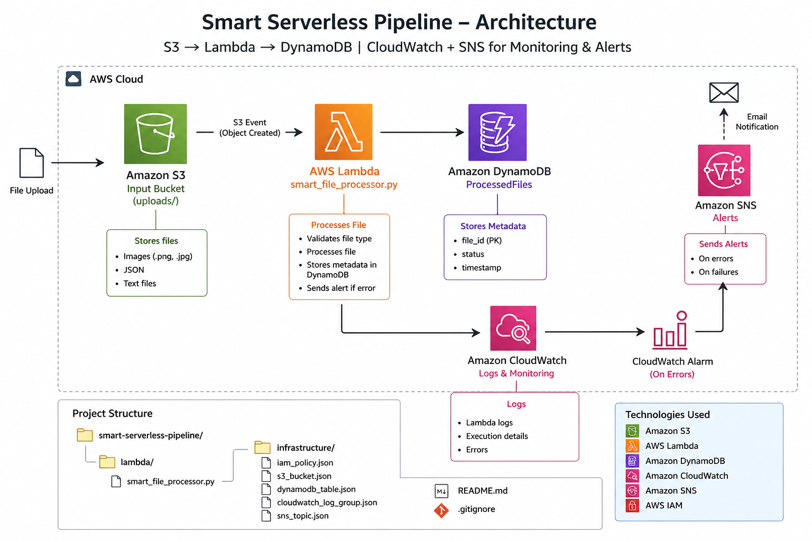

#  Smart Serverless Automation Pipeline (AWS)

##  Overview
This project demonstrates a **fully serverless, event-driven 
architecture** on AWS.  
It automates file processing using S3 triggers, Lambda functions, and 
stores results in DynamoDB with monitoring and alerting.

---

## 🏗️ Architecture Diagram

---

## ⚙️ AWS Services Used

- **Amazon S3** → File storage & event trigger  
- **AWS Lambda** → Serverless processing logic  
- **Amazon DynamoDB** → Structured data storage  
- **Amazon SNS** → Alert notifications (Email)  
- **Amazon CloudWatch** → Logs & monitoring  
- **IAM** → Secure role-based access  

---

## 🔄 Workflow

1. User uploads a file to **S3 bucket (uploads/ folder)**
2. **S3 event triggers Lambda function**
3. Lambda:
   - Validates file type
   - Processes file
   - Stores metadata in DynamoDB
4. Logs are sent to **CloudWatch**
5. If error occurs → **SNS sends alert email**

---

## 📁 Project Structure
smart-serverless-pipeline/
│
├── lambda/
│ └── smart_file_processor.py
│
├── infrastructure/
│ ├── iam_policy.json
│ ├── s3_bucket.json
│ ├── dynamodb_table.json
│ ├── cloudwatch_log_group.json
│ └── sns_topic.json
│
├── diagram/
│ └── architecture.png
│
├── README.md
└── .gitignore

---

##  Features

- Event-driven architecture  
- Fully serverless (no server management)  
- Automated file processing pipeline  
- Real-time error alert system  
- Cloud monitoring with logs  
- Secure IAM role configuration  

---

## 🔐 Security

- IAM roles follow **least privilege principle**
- No hardcoded credentials
- Controlled service access between AWS components  

---

##  Example Use Case

- Image processing pipeline  
- Log file analysis  
- JSON data ingestion system  
- Automated file validation system  

---

##  How to Use

1. Upload a file to S3 bucket (`uploads/ folder`)
2. Lambda will automatically process the file
3. Check:
   - DynamoDB → for stored data  
   - CloudWatch → for logs  
   - Email → for error alerts  

---

## Author : Anjle

AWS Serverless Project  
Cloud Engineering Portfolio Project  

---

## ⭐ GitHub

If you like this project, give it a ⭐ on Github
# smart-serverless-pipeline
